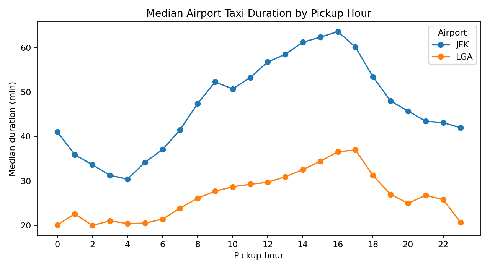
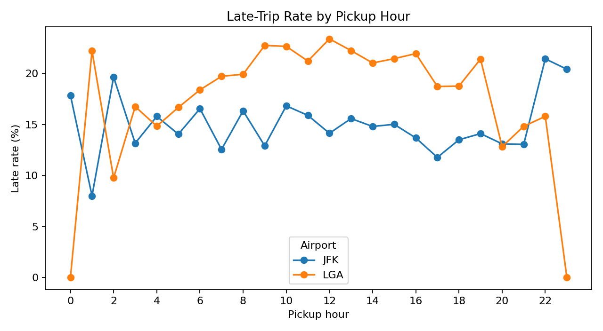
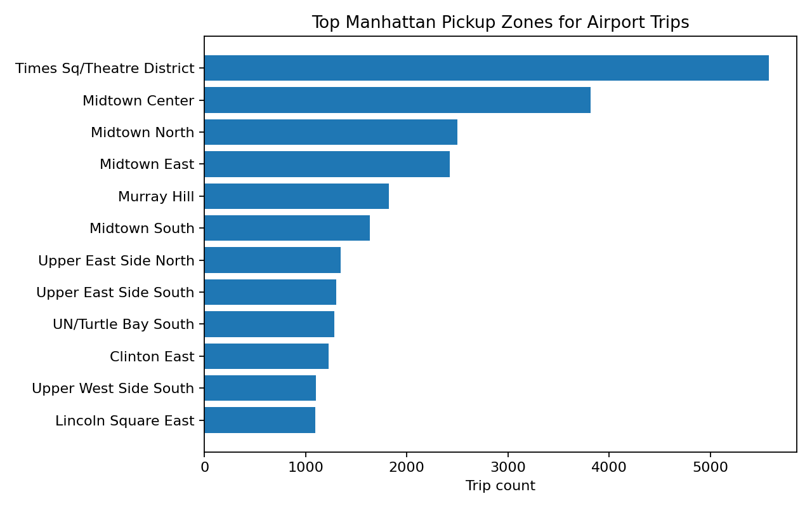
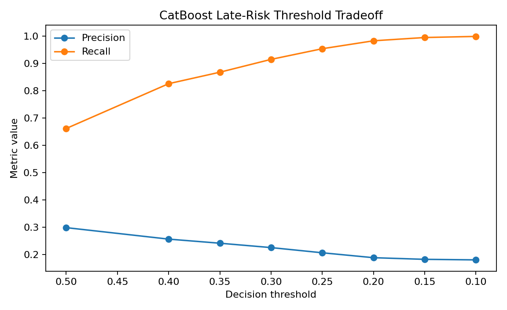

# NYC Taxi Trip Duration & Late-Risk Prediction

> Predict Manhattan → JFK/LGA taxi trip duration and classify late-trip risk using pre-trip features, tree-based models, threshold tuning, and buffer-time guidance.

[](#)
[](#)
[](#)
[](#)

## Why this project matters

Airport travel is a planning-under-uncertainty problem. A single ETA hides the risk of unusually slow trips, especially during congestion windows. This project turns raw NYC taxi records into a practical airport timing advisor:

1. **How long will the trip take?** → regression  
2. **What is the probability the trip will be unusually slow?** → imbalanced classification  
3. **How much buffer should a traveler add?** → threshold and policy layer

---

## Project Snapshot

| Item | Value |
|---|---:|
| Raw taxi records uploaded | 3,574,091 |
| Clean Manhattan → JFK/LGA trips | 43,079 |
| JFK trips | 18,986 |
| LGA trips | 24,093 |
| Late-trip rate | 18.1% |
| Median JFK duration | 54.2 min |
| Median LGA duration | 28.5 min |

The large raw taxi extract is **not committed** because it is over normal GitHub file-size limits. The repo includes the cleaned modeling dataset and a smaller sample for fast experimentation.

---

## Key Results

| Task | Best Model | Result | Interpretation |
|---|---|---:|---|
| Duration prediction | Random Forest / XGBoost | MAE ≈ **5.6 min** | Practical ETA accuracy for 30–60 min airport trips |
| Regression baseline | Historical median | MAE ≈ **13.1 min** | ML cuts average error by more than half |
| Late-risk classification | CatBoost | ROC-AUC ≈ **0.725** | Useful ranking of unusually slow trips |
| Risk-averse threshold | CatBoost @ 0.40 | Recall ≈ **0.826** | Catches most late trips for traveler use case |


---

## Modeling Flow

```text
data/raw taxi records
        ↓
filter to Manhattan pickups → JFK/LGA dropoffs
        ↓
clean impossible durations, zero distances, passenger issues
        ↓
engineer pre-trip features only
        ↓
regression model predicts duration
        ↓
classification model predicts late-risk
        ↓
threshold + buffer policy creates traveler guidance
```

---

## Feature Engineering

Used only features available before or at pickup time:

| Used | Excluded to avoid leakage |
|---|---|
| Pickup zone / location ID | Fare amount |
| Destination airport | Tip amount |
| Pickup hour / day of week | Tolls |
| Trip distance | Total amount |
| Passenger count | Any post-trip outcome |
| Payment type | Dropoff duration-derived fields |

This matters because including post-trip fare fields would make the model look better but fail in a real pre-trip prediction setting.

---

## EDA Highlights







---

## Late-Risk Framing

Late trips were defined as:

> `actual_duration > 1.2 × typical_duration` for the same airport × pickup hour × day-of-week group

This focuses the classifier on unusually slow trips, not just naturally long JFK rides.

Because late trips are the minority class, accuracy alone is misleading. The project evaluates precision, recall, F1, ROC-AUC, precision-recall tradeoffs, and threshold policy.



---

## Repository Structure

```text
.
├── data/
│   ├── processed/
│   │   ├── taxi_clean_for_modeling.csv
│   │   └── taxi_clean_sample.csv
│   ├── raw/
│   │   └── .gitkeep
│   └── reference/
│       └── taxi_zone_lookup.csv
├── docs/
│   ├── model_card.md
│   ├── project_summary.md
│   └── github_update_steps.md
├── notebooks/
│   ├── 00_project_overview.ipynb
│   ├── 01_eda_airport_trips.ipynb
│   ├── 02_duration_regression.ipynb
│   ├── 03_late_risk_classification.ipynb
│   └── original_cleaned/
├── reports/
│   ├── figures/
│   └── model_results.md
├── scripts/
│   ├── make_dataset.py
│   ├── train_classification.py
│   └── train_regression.py
├── src/taxi_risk/
├── requirements.txt
└── README.md
```

---

## How to Run

```bash
git clone https://github.com/awhite121/NYC-Taxi-Trip-Duration-Late-Risk-Prediction.git
cd NYC-Taxi-Trip-Duration-Late-Risk-Prediction
python -m venv .venv
source .venv/bin/activate  # Windows: .venv\Scripts\activate
pip install -r requirements.txt
```

Run the notebooks:

```bash
jupyter lab
```

Or run scripts:

```bash
PYTHONPATH=src python scripts/train_regression.py
PYTHONPATH=src python scripts/train_classification.py
```

---

## Limitations

- Single-month sample; seasonality is not captured.
- No weather, incident, subway disruption, major event, or live traffic data.
- Focused only on Manhattan pickups to JFK/LGA.
- Offline model; not deployed as a live routing service.
- Trip distance is assumed to be available/pre-estimated before pickup.

---

## Next Steps

- Add multi-month / multi-year data.
- Add weather, holiday, and event features.
- Calibrate late-risk probabilities.
- Build a small Streamlit timing advisor.
- Add SHAP or permutation importance for explainability.
- Train live origin-destination models using external routing estimates.

---

## Author

Andrew White  
MSBA / Data Analytics / Applied Machine Learning
