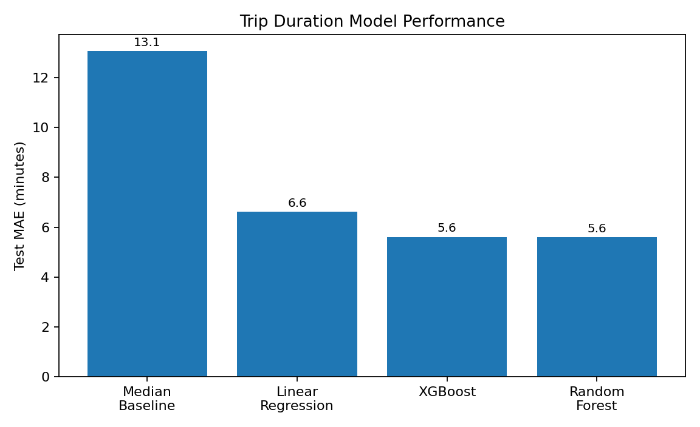

# When to Leave NYC ✈️

[](https://nyc-airport-dashboard.streamlit.app)


A decision-support app for Manhattan travelers heading to **JFK** or **LaGuardia**. Select a pickup zone, airport, flight time, and planning style to receive a recommended leave time, uncertainty range, slow-trip risk, and historical context.

## Live App

**Streamlit:** https://nyc-airport-dashboard.streamlit.app

> The app URL becomes active after the first successful Streamlit Community Cloud deployment.

## What the App Does

- Click or search across **63 Manhattan taxi zones**
- Switch between **JFK and LaGuardia**
- Enter flight date, departure time, passengers, and trip type
- Calculate an iterative **leave-by recommendation**
- Show expected duration, p80, p90, road budget, and late-trip probability
- Compare alternative departure windows
- Explore hourly, weekday, airport, zone, heatmap, and spatial analytics
- Review model performance, feature influence, thresholds, and limitations
- Work across desktop and mobile without paid map APIs

## Project Snapshot

| Item | Value |
|---|---:|
| Raw taxi records analyzed | 3,574,091 |
| Clean Manhattan → JFK/LGA trips | 43,079 |
| JFK trips | 18,986 |
| LGA trips | 24,093 |
| Late-trip rate | 18.1% |
| Median JFK duration | 54.2 min |
| Median LGA duration | 28.5 min |
| Pre-scored app scenarios | 21,168 |

## Modeling Results

| Task | Best Result | Interpretation |
|---|---:|---|
| Duration prediction | MAE ≈ **5.6 min** | Practical error for airport-trip planning |
| Historical-median baseline | MAE ≈ **13.1 min** | ML cuts average error by more than half |
| Late-risk classification | ROC-AUC ≈ **0.725** | Useful ranking of unusually slow trips |
| Risk-averse threshold | Recall ≈ **0.826** | Catches most late trips at the selected policy threshold |



## How the Product Works

```text
NYC yellow-taxi records
        ↓
Manhattan pickup + JFK/LGA destination filtering
        ↓
Data cleaning and leakage-safe feature engineering
        ↓
Duration, upper-quantile, and late-risk models
        ↓
21,168 pre-scored zone × airport × weekday × hour scenarios
        ↓
Interactive leave-time recommendation and analytics dashboard
```

The deployed app uses a self-contained interactive dashboard embedded through Streamlit. Predictions are pre-scored from the included modeling dataset, which keeps the public app fast and removes the need for a paid routing API or persistent Python inference server.

## Run Locally

```bash
git clone https://github.com/awhite121/nyc-airport-dashboard.git
cd nyc-airport-dashboard
python3 -m venv .venv
source .venv/bin/activate
pip install -r requirements.txt
streamlit run streamlit_app.py
```

Then open `http://localhost:8501`.

## Deploy on Streamlit Community Cloud

Use these exact settings:

| Setting | Value |
|---|---|
| Repository | `awhite121/nyc-airport-dashboard` |
| Branch | `main` |
| Main file path | `streamlit_app.py` |
| App URL | `nyc-airport-dashboard` or another available name |
| Python | `3.12` recommended |

Click **Deploy**. Streamlit reads `requirements.txt` automatically.

## Reproduce the ML Work

The public app only needs Streamlit. Install the full modeling environment separately:

```bash
pip install -r requirements-dev.txt
PYTHONPATH=src python scripts/train_regression.py
PYTHONPATH=src python scripts/train_classification.py
```

Or explore the notebooks:

```bash
jupyter lab
```

## Repository Structure

```text
.
├── streamlit_app.py                 # Streamlit deployment entrypoint
├── .streamlit/config.toml           # App theme
├── requirements.txt                 # Lightweight deployment dependencies
├── requirements-dev.txt             # Modeling and notebook dependencies
├── dashboard/
│   ├── when-to-leave-nyc-dashboard.html
│   ├── index.html
│   ├── app.js
│   ├── styles.css
│   ├── data/app_data.js
│   └── assets/
├── data/
│   ├── processed/
│   └── reference/
├── notebooks/
├── reports/figures/
├── scripts/
├── src/taxi_risk/
└── docs/
```

## Feature Engineering

Only information available before or at pickup is used.

| Used | Excluded to prevent leakage |
|---|---|
| Pickup zone | Fare amount |
| Destination airport | Tip amount |
| Pickup hour and weekday | Tolls and total amount |
| Trip distance | Dropoff-derived fields |
| Passenger count | Post-trip outcomes |
| Payment type | Actual trip duration |

Late trips are defined relative to the typical duration for the same airport, pickup hour, and weekday group:

```text
actual duration > 1.2 × typical grouped duration
```

## Limitations

- The source data covers a single month, so broader seasonality is not represented.
- The model does not include live traffic, weather, incidents, events, or flight-terminal conditions.
- The app focuses on Manhattan pickups to JFK and LGA.
- Recommendations are planning guidance, not guaranteed arrival times.

## Next Product Steps

- Add multi-month and multi-year taxi records
- Incorporate weather, holidays, events, and live routing estimates
- Add calibrated probability intervals and SHAP explanations
- Add saved trips and shareable recommendation links
- Expand to Brooklyn, Queens, the Bronx, Staten Island, and Newark

## Author

**Andrew White**  
MSBA · Data Analytics · Applied Machine Learning · AI Product Development
